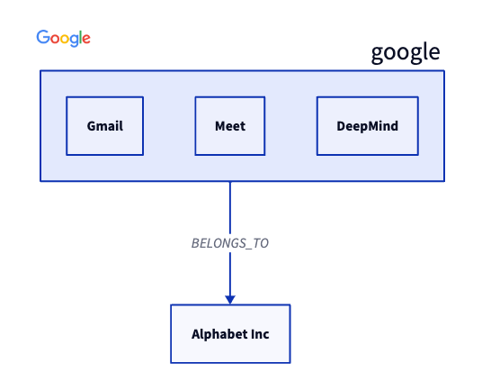

# d2lang-cs


An unofficial interface for building [D2](https://github.com/terrastruct/d2) diagram files in C# and dotnet.

# Installation

```bash
dotnet add package d2lang-cs
```

# Usage

```csharp
using d2;

var umbrella = new D2Shape("alphabet", "Alphabet Inc", Shape.Rectangle);
var company = new D2Shape("google", null, Shape.Rectangle);

company.Add(new D2Shape("gmail", "Gmail", Shape.Rectangle));
company.Add(new D2Shape("meet", "Meet", Shape.Rectangle));
company.Add(new D2Shape("deepmind", "DeepMind", Shape.Rectangle));

company.Icon = "https://www.google.com/images/branding/googlelogo/2x/googlelogo_color_92x30dp.png";

var connection = new D2Connection(company.Name, umbrella.Name, Direction.TO, "BELONGS_TO");

var diagram = new D2Diagram(new[] { umbrella, company }, new[] { connection });

Console.WriteLine(diagram.ToString());
```

# D2 Output
```d2-lang
alphabet: Alphabet Inc {
  shape: rectangle
}
google: {
  gmail: Gmail {
    shape: rectangle
  }
  meet: Meet {
    shape: rectangle
  }
  deepmind: DeepMind {
    shape: rectangle
  }
  icon: https://www.google.com/images/branding/googlelogo/2x/googlelogo_color_92x30dp.png
  shape: rectangle
}
google -> alphabet: BELONGS_TO
```

# Diagram Output


# Documentation
## Supported
- [x] Shapes (nodes)
- [x] Connections (edges)
- [x] Styles
- [x] Containers (nodes/links in nodes)
- [x] Arrow directions
- [x] Markdown / latex / block strings / code in shapes
- [x] Shape icons
- [ ] SQL table shapes
- [ ] Class shapes
- [ ] Comments

# Inspiration & Thanks
- [Kreshnik/d2lang-js](https://github.com/Kreshnik/d2lang-js)
- [MrBlenny/py-d2](https://github.com/MrBlenny/py-d2)

# Thank me!
If you like what I'm doing and you would like to thank me, please consider:

<a href="https://www.buymeacoffee.com/stephanvs" target="_blank">

</a>

Thank you for your support!

<hr />

Copyright &copy; 2023 [Stephan van Stekelenburg](https://stephanvs.com) - Provided under [MIT License](LICENSE)
