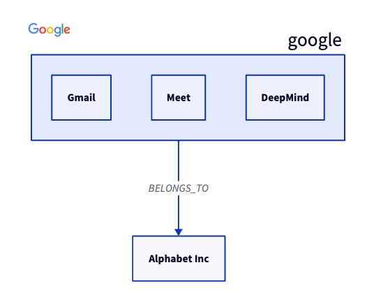

# d2lang-cs


`d2lang-cs` is an unofficial .NET library for constructing [D2](https://d2lang.com/) diagram source from C#.

The library produces D2 text; rendering that text to SVG, PNG, PDF, or another output format is handled separately by the [D2 CLI](https://d2lang.com/tour/install/).

## Installation

```bash
dotnet add package d2lang-cs
```

The current package targets .NET 10. Applications only need the D2 CLI if they also want to validate or render the generated source.

## Quick start

```csharp
using d2;

var umbrella = new D2Shape("alphabet", "Alphabet Inc", Shape.Rectangle);
var company = new D2Shape("google", null, Shape.Rectangle)
{
    new D2Shape("gmail", "Gmail", Shape.Rectangle),
    new D2Shape("meet", "Meet", Shape.Rectangle),
    new D2Shape("deepmind", "DeepMind", Shape.Rectangle),
};

company.Icon = "https://www.google.com/images/branding/googlelogo/2x/googlelogo_color_92x30dp.png";

var connection = new D2Connection(
    company.Name,
    umbrella.Name,
    Direction.TO,
    "BELONGS_TO");

var diagram = new D2Diagram(
    new[] { umbrella, company },
    new[] { connection });

Console.WriteLine(diagram);
```

This produces:

```d2
alphabet: Alphabet Inc {
  shape: rectangle
}
google: {
  gmail: Gmail {
    shape: rectangle
  }
  meet: Meet {
    shape: rectangle
  }
  deepmind: DeepMind {
    shape: rectangle
  }
  icon: https://www.google.com/images/branding/googlelogo/2x/googlelogo_color_92x30dp.png
  shape: rectangle
}
google -> alphabet: BELONGS_TO
```



To validate or render saved output with D2:

```bash
d2 validate diagram.d2
d2 diagram.d2 diagram.svg
```

## Supported features

- Shapes and containers
- Connections with forward, reverse, bidirectional, and undirected edges
- Shape styles
- Markdown, LaTeX, block strings, and code text in shapes
- Shape icons
- `near` positioning

The `Shape` type exposes D2's `sql_table`, `class`, and `sequence_diagram` shape values, but the library does not yet provide specialized models for their fields, methods, columns, or sequence semantics.

## Compatibility and support

- **.NET:** the current package targets `net10.0`.
- **D2 syntax checks:** CI validates the example's generated source with D2 CLI `v0.7.1`.
- **Project status:** this is a community-maintained integration and is not an official D2 project.
- **Issues:** use [GitHub Issues](https://github.com/Stephanvs/d2lang-cs/issues) for reproducible bugs and focused feature requests.

Because D2 has syntax with reserved characters, treat names and labels as trusted D2 source until the planned serialization work is complete. When values can contain punctuation, quotes, newlines, URL fragments, or other user-controlled text, validate the generated document with the D2 CLI before rendering or publishing it.

## Roadmap

The next areas under consideration are:

- Centralized quoting, escaping, and serialization
- Parser-backed tests for generated diagrams
- A broader, extensible property model for newer D2 features
- Typed support for SQL tables, classes, and sequence diagrams
- Wider .NET target-framework compatibility
- More consistent immutable or builder-style APIs

The roadmap is directional rather than a release commitment. Contributions are welcome; see [CONTRIBUTING.md](CONTRIBUTING.md) for the development and release checks.

## Inspiration and thanks

- [Kreshnik/d2lang-js](https://github.com/Kreshnik/d2lang-js)
- [MrBlenny/py-d2](https://github.com/MrBlenny/py-d2)

If this project helps you, you can [support its maintenance on Buy Me a Coffee](https://www.buymeacoffee.com/stephanvs).

Copyright &copy; 2023 Stephan van Stekelenburg. Provided under the [MIT License](LICENSE).
